# AI Intelligent Protocol Design - YouMeYou Platform

## 📋 **Current State Analysis**

### **Problems Identified:**
1. **Static AI Responses**: Same generic responses regardless of context
2. **No Memory/Context**: Each interaction is isolated 
3. **Poor Prompt Engineering**: Generic templates without intelligence
4. **No Learning Layer**: AI doesn't adapt to user patterns
5. **Inefficient Resource Usage**: Redundant API calls

### **Current Flow Issues:**
```
User Query → Generic Prompt → Gemini API → Static Response → Basic Parsing
```

## 🎯 **Intelligent Protocol Requirements**

### **Core Objectives:**
- **Cost-Effective**: Minimize API calls and use free/cheap models
- **Highly Scalable**: Handle multiple users efficiently  
- **Context-Aware**: Remember project history and user patterns
- **Code Generation**: Cursor-like intelligent code suggestions
- **Adaptive**: Learn from user interactions over time

### **Budget Constraints:**
- **Current**: Gemini Free Tier (limited quota)
- **Future**: Paid Gemini when POC proves value
- **Strategy**: Hybrid approach with free models for intelligence layer

## 🏗️ **Proposed Architecture**

### **1. Multi-Layer Intelligence System**

```mermaid
graph TB
    A["👤 User Interface"] --> B["🧠 Context Manager"]
    B --> C["📊 Intelligence Layer"]
    
    C --> D["🔍 Embeddings<br/>HuggingFace Free"]
    C --> E["📚 Knowledge Base<br/>ChromaDB"]
    C --> F["🎯 Pattern Recognition<br/>User Behavior"]
    
    D --> G["⚡ Prompt Optimizer"]
    E --> G
    F --> G
    
    G --> H["🚪 LLM Gateway"]
    
    H --> I["💎 Gemini 2.5 Flash<br/>$$ Code Generation"]
    H --> J["🤗 HuggingFace Models<br/>Free Classification"]
    H --> K["⚡ Local Models<br/>Fast Processing"]
    
    I --> L["📝 Response Processor"]
    J --> L
    K --> L
    
    L --> M["✨ Intelligent Output"]
    
    B --> N["💾 Redis Cache<br/>User Sessions"]
    E --> O["🗄️ Vector Database<br/>Context Storage"]
    
    style A fill:#e1f5fe
    style C fill:#f3e5f5
    style H fill:#fff3e0
    style L fill:#e8f5e8
    style I fill:#ffebee
    style J fill:#e3f2fd
    style K fill:#f1f8e9
```



### **2. Detailed Layer Architecture with Auth Integration**

```
┌─────────────────────────────────────────────────────────────┐
│                    USER INTERFACE LAYER                     │
│  ┌─────────────────┬─────────────────┬─────────────────────┐ │
│  │   WEB CLIENT    │   MOBILE APP    │   API CLIENTS       │ │
│  │   • React UI    │   • Native      │   • Third Party     │ │
│  │   • Canvas      │   • Flutter     │   • Integrations    │ │
│  │   • Dashboard   │   • React Native│   • Webhooks        │ │
│  └─────────────────┴─────────────────┴─────────────────────┘ │
└─────────────────────┬───────────────────────────────────────┘
                      │
┌─────────────────────▼───────────────────────────────────────┐
│                 AUTH & SESSION LAYER                        │
│  ┌─────────────────┬─────────────────┬─────────────────────┐ │
│  │   AUTH SERVICE  │   USER PROFILES │   SESSION MGMT      │ │
│  │   • JWT Tokens  │   • Preferences │   • Active Sessions │ │
│  │   • User Roles  │   • Skill Level │   • Context State   │ │
│  │   • Permissions │   • History     │   • Conversation    │ │
│  └─────────────────┴─────────────────┴─────────────────────┘ │
└─────────────────────┬───────────────────────────────────────┘
                      │
┌─────────────────────▼───────────────────────────────────────┐
│                CONTEXT MANAGER LAYER                        │
│  ┌─────────────────┬─────────────────┬─────────────────────┐ │
│  │   USER CONTEXT  │   PROJECT       │   CONVERSATION      │ │
│  │   • Profile     │   • Architecture│   • History         │ │
│  │   • Preferences │   • Components  │   • Thread State    │ │
│  │   • Patterns    │   • Dependencies│   • Agent Memory    │ │
│  └─────────────────┴─────────────────┴─────────────────────┘ │
└─────────────────────┬───────────────────────────────────────┘
                      │
┌─────────────────────▼───────────────────────────────────────┐
│              INTELLIGENCE LAYER                             │
│  ┌─────────────────┬─────────────────┬─────────────────────┐ │
│  │   EMBEDDINGS    │   KNOWLEDGE     │   PATTERN ENGINE    │ │
│  │   • Similarity  │   • Code Base   │   • User Behavior   │ │
│  │   • Retrieval   │   • Templates   │   • Success Metrics│ │
│  │   • Clustering  │   • Best Practices│ • Learning Algo   │ │
│  └─────────────────┴─────────────────┴─────────────────────┘ │
└─────────────────────┬───────────────────────────────────────┘
                      │
┌─────────────────────▼───────────────────────────────────────┐
│              A2A ORCHESTRATION LAYER                        │
│  ┌─────────────────┬─────────────────┬─────────────────────┐ │
│  │   AGENT ROUTER  │   TASK PLANNER  │   COLLABORATION     │ │
│  │   • Agent Select│   • Multi-step  │   • Agent Handoff   │ │
│  │   • Capability  │   • Dependencies│   • Consensus       │ │
│  │   • Load Balance│   • Prioritize  │   • Conflict Res    │ │
│  └─────────────────┴─────────────────┴─────────────────────┘ │
└─────────────────────┬───────────────────────────────────────┘
                      │
┌─────────────────────▼───────────────────────────────────────┐
│                PROMPT OPTIMIZER                             │
│  ┌─────────────────┬─────────────────┬─────────────────────┐ │
│  │   DYNAMIC BUILD │   CONTEXT INJ   │   TOKEN OPTIMIZER   │ │
│  │   • Template    │   • Relevant    │   • Compression     │ │
│  │   • Persona     │   • Contextual  │   • Truncation      │ │
│  │   • Examples    │   • Historical  │   • Prioritization  │ │
│  └─────────────────┴─────────────────┴─────────────────────┘ │
└─────────────────────┬───────────────────────────────────────┘
                      │
┌─────────────────────▼───────────────────────────────────────┐
│                 LLM GATEWAY                                 │
│  ┌─────────────────┬─────────────────┬─────────────────────┐ │
│  │   GEMINI API    │   HUGGING FACE  │   LOCAL MODELS      │ │
│  │   • Code Gen    │   • Embeddings  │   • Fast Processing │ │
│  │   • Reasoning   │   • Classification│ • Simple Tasks    │ │
│  │   • Complex     │   • Summarization│ • Cost Effective  │ │
│  └─────────────────┴─────────────────┴─────────────────────┘ │
└─────────────────────┬───────────────────────────────────────┘
                      │
┌─────────────────────▼───────────────────────────────────────┐
│              RESPONSE PROCESSOR                             │
│  ┌─────────────────┬─────────────────┬─────────────────────┐ │
│  │   PARSER        │   VALIDATOR     │   FEEDBACK LOOP     │ │
│  │   • Code Extract│   • Quality     │   • User Rating     │ │
│  │   • Action Det  │   • Accuracy    │   • Success Track   │ │
│  │   • Format      │   • Safety      │   • Learning        │ │
│  └─────────────────┴─────────────────┴─────────────────────┘ │
└─────────────────────────────────────────────────────────────┘
```

## 🔄 **Current vs New Architecture Comparison**

### **CURRENT A2A SYSTEM:**
```yaml
Current Flow:
  User Query → Generic Prompt → Agent Selection → Single LLM → Basic Response

Problems:
  - Static agent selection (hardcoded)
  - No user context awareness
  - Generic prompts for all users
  - No learning or adaptation
  - Single model dependency
  - No conversation memory
  - No cost optimization
```

### **NEW INTELLIGENT A2A SYSTEM:**
```yaml
New Flow:
  User Query → Context Analysis → Intelligent Agent Selection → 
  Multi-Model Routing → Optimized Prompt → Enhanced Response

Improvements:
  - Dynamic agent selection based on context
  - User-aware personalization
  - Conversation memory and learning
  - Multi-model cost optimization
  - Collaborative agent workflows
  - Feedback-driven improvement
```

## 💡 **Cost-Effective Model Strategy**

### **Hybrid Model Approach:**

#### **1. FREE TIER MODELS (Intelligence Layer):**
```yaml
Embeddings:
  - Model: "sentence-transformers/all-MiniLM-L6-v2"
  - Source: Hugging Face (Free)
  - Purpose: Context similarity, code search
  - Cost: $0

Classification:
  - Model: "microsoft/DialoGPT-medium" 
  - Source: Hugging Face (Free)
  - Purpose: Intent detection, task routing
  - Cost: $0

Code Understanding:
  - Model: "microsoft/codebert-base"
  - Source: Hugging Face (Free) 
  - Purpose: Code analysis, pattern detection
  - Cost: $0
```

#### **2. PAID MODELS (Generation Layer):**
```yaml
Code Generation:
  - Model: "gemini-2.5-flash"
  - Source: Google AI (Paid)
  - Purpose: Complex code generation, architecture advice
  - Cost: Pay per use (optimized)

Complex Reasoning:
  - Model: "gemini-2.5-pro" (Future)
  - Source: Google AI (Paid)
  - Purpose: Advanced system design, complex analysis
  - Cost: Premium tier
```

## 🧠 **Intelligent Context Management**

### **1. Vector Database Strategy:**
```yaml
Options:
  - Chroma DB (Free, Self-hosted)
  - Pinecone (Free tier: 1M vectors)
  - Weaviate (Open source)
  - FAISS (Facebook, Free)

Recommendation: ChromaDB
  - Completely free
  - Easy Docker deployment
  - Python integration
  - Persistent storage
```

### **2. Context Types to Store:**
```yaml
User Context:
  - Coding patterns
  - Preferred architectures
  - Technology stack preferences
  - Error patterns and solutions

Project Context:
  - Architecture decisions
  - Component relationships
  - Code patterns used
  - Performance considerations

Knowledge Base:
  - Best practices
  - Common solutions
  - Code templates
  - Architecture patterns
```

## 🚀 **Smart Prompt Engineering**

### **Dynamic Prompt Construction:**
```javascript
// Intelligent Prompt Builder
const buildIntelligentPrompt = (userQuery, context) => {
  const relevantContext = retrieveRelevantContext(userQuery);
  const userProfile = getUserProfile(context.userId);
  const projectHistory = getProjectHistory(context.projectId);
  
  return `
    ROLE: Expert ${getOptimalAgent(userQuery)} specializing in ${userProfile.expertise}
    
    CONTEXT: 
    ${relevantContext.architecturePatterns}
    ${relevantContext.codeExamples}
    ${relevantContext.bestPractices}
    
    USER PROFILE:
    - Experience: ${userProfile.level}
    - Preferences: ${userProfile.preferences}
    - Previous Solutions: ${userProfile.successfulPatterns}
    
    PROJECT STATE:
    ${projectHistory.currentArchitecture}
    ${projectHistory.recentChanges}
    
    TASK: ${userQuery}
    
    REQUIREMENTS:
    - Generate production-ready code
    - Follow established patterns in this project
    - Consider scalability and maintainability
    - Provide step-by-step implementation
  `;
};
```

## 📊 **Cost Optimization Strategy**

### **1. Request Routing:**
```yaml
Simple Queries (Free Models):
  - Code formatting
  - Basic explanations
  - Template suggestions
  - Pattern matching

Complex Queries (Paid Models):
  - Architecture design
  - Complex code generation
  - System optimization
  - Advanced problem solving
```

### **2. Caching Strategy:**
```yaml
Response Cache:
  - Similar queries → Cached responses
  - Code templates → Pre-generated
  - Common patterns → Stored solutions

Context Cache:
  - User profiles → Redis
  - Project state → Vector DB
  - Knowledge base → Persistent storage
```

### **3. Token Optimization:**
```yaml
Strategies:
  - Compress context using embeddings
  - Use abbreviated prompts for simple tasks
  - Batch similar requests
  - Implement response streaming
```

## 🔄 **Implementation Phases**

### **Phase 1: Foundation (Week 1-2)**
- [ ] Setup ChromaDB vector database
- [ ] Implement Hugging Face embedding integration
- [ ] Create context management system
- [ ] Basic prompt optimization

### **Phase 2: Intelligence Layer (Week 3-4)**
- [ ] User profile tracking
- [ ] Project context accumulation
- [ ] Pattern recognition system
- [ ] Smart agent routing

### **Phase 3: Advanced Features (Week 5-6)**
- [ ] Cursor-like code completion
- [ ] Architecture pattern suggestions
- [ ] Automated code review
- [ ] Performance optimization hints

### **Phase 4: Optimization (Week 7-8)**
- [ ] Cost monitoring dashboard
- [ ] Response time optimization
- [ ] Model performance tuning
- [ ] Scalability testing

## 🎯 **Success Metrics**

### **Performance KPIs:**
- Response time: < 2 seconds
- Accuracy: > 85% helpful responses
- Cost per interaction: < $0.01
- User satisfaction: > 4.5/5

### **Intelligence KPIs:**
- Context relevance: > 90%
- Code generation success: > 80%
- User pattern learning: Improve over time
- Repeat query reduction: > 60%

## 🛠️ **Technical Stack**

### **Backend Services:**
```yaml
Vector Database: ChromaDB (Docker)
Embedding Service: Hugging Face Transformers
Context Manager: Node.js + Redis
LLM Gateway: Multi-model proxy
Response Processor: Custom parsing engine
```

### **Infrastructure:**
```yaml
Deployment: Docker containers
Storage: Vector DB + Redis + MongoDB
Monitoring: Prometheus + Grafana
Scaling: Horizontal pod autoscaling
```

## 💰 **Cost Projections**

### **Free Tier Usage:**
- Embeddings: $0/month
- Classification: $0/month
- Vector DB: $0/month (self-hosted)
- Basic processing: $0/month

### **Paid Usage (Optimized):**
- Gemini API: ~$10-50/month (depending on usage)
- Infrastructure: ~$20/month
- **Total: $30-70/month for POC**

### **Scaling Projections:**
- 100 users: ~$100-200/month
- 1000 users: ~$500-1000/month
- Revenue sharing model can cover costs

## 🚦 **Next Steps**

1. **Finalize Architecture**: Review and approve this design
2. **POC Development**: Start with Phase 1 implementation
3. **Model Testing**: Validate Hugging Face models performance
4. **Cost Monitoring**: Implement usage tracking from day 1
5. **User Feedback**: Early testing with real use cases

---

**Status**: Design Phase Complete ✅  
**Next**: Implementation Planning  
**Timeline**: 8 weeks to full implementation  
**Budget**: $30-70/month for POC phase 

## 🔍 **Deep Dive: Layer-by-Layer Analysis**

### **Layer 1: Auth & Session Integration**
```yaml
Current A2A Integration:
  Problem: No user context in agent selection
  
New Integration:
  Auth Service → User Profile → Agent Personalization
  
Data Flow:
  1. User logs in → JWT token with user_id
  2. Extract: skill_level, preferences, history
  3. Pass to Context Manager for personalization
  
Implementation:
  - Extend auth service with AI preferences
  - Add user_profile table with AI interaction data
  - Create middleware to inject user context
```

**Enhanced User Profile Schema:**
```sql
CREATE TABLE ai_user_profiles (
  user_id VARCHAR(255) PRIMARY KEY,
  skill_level ENUM('beginner', 'intermediate', 'expert'),
  preferred_agents JSON, -- ['arch-001', 'db-001']
  coding_patterns JSON, -- {'framework': 'react', 'style': 'functional'}
  interaction_history JSON,
  success_metrics JSON, -- response ratings, code adoption
  created_at TIMESTAMP,
  updated_at TIMESTAMP
);
```

### **Layer 2: Context Manager - The Brain**
```yaml
Current A2A Problem:
  - No conversation memory
  - Each query is isolated
  - No project context awareness

New Context Manager:
  - Maintains conversation threads
  - Tracks project evolution
  - Learns user patterns
  
Key Components:
  1. Session Manager: Active conversations
  2. Project Tracker: Architecture evolution
  3. Pattern Learner: User behavior analysis
```

**Context Manager Implementation:**
```javascript
class IntelligentContextManager {
  constructor() {
    this.redis = new Redis(); // Session cache
    this.vectorDB = new ChromaDB(); // Long-term memory
    this.patterns = new PatternEngine();
  }
  
  async buildContext(userId, projectId, query) {
    const userProfile = await this.getUserProfile(userId);
    const projectContext = await this.getProjectContext(projectId);
    const conversationHistory = await this.getConversationHistory(userId);
    const relevantPatterns = await this.findRelevantPatterns(query);
    
    return {
      user: userProfile,
      project: projectContext,
      conversation: conversationHistory,
      patterns: relevantPatterns,
      timestamp: Date.now()
    };
  }
}
```

### **Layer 3: Intelligence Layer - Pattern Recognition**
```yaml
Current A2A Limitation:
  - Static agent capabilities
  - No learning from interactions
  
New Intelligence Features:
  1. Embeddings: Semantic similarity search
  2. Knowledge Base: Accumulated wisdom
  3. Pattern Engine: User behavior learning
  
Cost Strategy:
  - Use free models for pattern recognition
  - Cache expensive computations
  - Batch similar queries
```

**Embedding Strategy:**
```python
# Free Hugging Face Models
from sentence_transformers import SentenceTransformer

class EmbeddingService:
    def __init__(self):
        # Free, fast, good quality
        self.model = SentenceTransformer('all-MiniLM-L6-v2')
        self.code_model = SentenceTransformer('microsoft/codebert-base')
    
    def find_similar_contexts(self, query, user_id):
        query_embedding = self.model.encode(query)
        
        # Search in user's historical successful interactions
        similar_contexts = self.vector_db.similarity_search(
            query_embedding, 
            filter={'user_id': user_id, 'success_rating': {'$gte': 4}}
        )
        return similar_contexts
```

### **Layer 4: A2A Orchestration - Enhanced Agent Selection**
```yaml
Current A2A System:
  File: services/design-microservice/src/services/a2aService.js
  Problem: Hardcoded agent selection logic
  
Current Agent Selection:
  if (task.type === 'architecture') return agents['arch-001'];
  
New Intelligent Selection:
  1. Analyze query semantics
  2. Check user's successful agent history
  3. Consider project context
  4. Multi-agent collaboration for complex tasks
```

**Enhanced A2A Agent Router:**
```javascript
class IntelligentAgentRouter {
  async selectOptimalAgent(query, context) {
    // 1. Semantic analysis of query
    const queryType = await this.classifyQuery(query);
    
    // 2. User's successful agent history
    const userPreferences = context.user.successful_agents;
    
    // 3. Project context matching
    const projectNeeds = this.analyzeProjectNeeds(context.project);
    
    // 4. Agent capability scoring
    const agentScores = await this.scoreAgents({
      queryType,
      userPreferences,
      projectNeeds,
      conversationHistory: context.conversation
    });
    
    // 5. Select best agent or agent team
    return this.selectAgent(agentScores);
  }
  
  async planMultiAgentTask(complexQuery, context) {
    // For complex queries, plan multi-step agent collaboration
    const taskPlan = await this.createTaskPlan(complexQuery);
    const agentTeam = await this.assembleAgentTeam(taskPlan);
    
    return {
      plan: taskPlan,
      agents: agentTeam,
      coordination: this.createCoordinationStrategy(agentTeam)
    };
  }
}
```

### **Layer 5: Prompt Optimizer - Dynamic Intelligence**
```yaml
Current A2A Problem:
  - Static prompt templates
  - Same prompt for all users
  - No context optimization
  
New Dynamic Prompting:
  1. User-specific prompt adaptation
  2. Context-aware examples
  3. Token optimization for cost
  4. Model-specific formatting
```

**Intelligent Prompt Builder:**
```javascript
class DynamicPromptBuilder {
  buildIntelligentPrompt(agent, query, context) {
    const userLevel = context.user.skill_level;
    const projectTech = context.project.technology_stack;
    const successfulPatterns = context.patterns.successful_responses;
    
    // Base prompt with agent personality
    let prompt = this.getAgentPersona(agent, userLevel);
    
    // Add relevant context (compressed via embeddings)
    prompt += this.injectRelevantContext(context, maxTokens: 500);
    
    // Add successful examples from user's history
    prompt += this.addPersonalizedExamples(successfulPatterns);
    
    // Add project-specific constraints
    prompt += this.addProjectConstraints(projectTech);
    
    // Optimize for target model
    return this.optimizeForModel(prompt, agent.model);
  }
  
  // Example: Different prompts for different skill levels
  getAgentPersona(agent, skillLevel) {
    const personas = {
      beginner: `You are a patient ${agent.name} who explains concepts step-by-step with examples.`,
      intermediate: `You are an experienced ${agent.name} who provides practical solutions with best practices.`,
      expert: `You are a senior ${agent.name} who gives concise, advanced recommendations with trade-offs.`
    };
    
    return personas[skillLevel];
  }
}
```

### **Layer 6: LLM Gateway - Cost-Optimized Routing**
```yaml
Current A2A System:
  - Only uses Gemini
  - No cost optimization
  - No model selection logic
  
New Gateway Strategy:
  1. Route simple tasks to free models
  2. Use Gemini only for complex generation
  3. Implement response caching
  4. Model fallback strategies
```

**Smart Model Router:**
```javascript
class LLMGateway {
  async routeQuery(query, agent, context) {
    const complexity = await this.analyzeComplexity(query);
    const cacheKey = this.generateCacheKey(query, context);
    
    // Check cache first
    const cachedResponse = await this.getFromCache(cacheKey);
    if (cachedResponse) return cachedResponse;
    
    // Route based on complexity and cost
    if (complexity.score < 0.3) {
      // Simple queries → Free models
      return await this.callHuggingFaceModel(query, agent);
    } else if (complexity.score < 0.7) {
      // Medium complexity → Gemini Flash
      return await this.callGeminiFlash(query, agent, context);
    } else {
      // Complex queries → Gemini Pro (when available)
      return await this.callGeminiPro(query, agent, context);
    }
  }
  
  async callHuggingFaceModel(query, agent) {
    // Use free models for simple tasks
    const models = {
      'classification': 'microsoft/DialoGPT-medium',
      'summarization': 'facebook/bart-large-cnn',
      'code-understanding': 'microsoft/codebert-base'
    };
    
    return await this.huggingFaceAPI.generate({
      model: models[agent.capability],
      prompt: query,
      max_tokens: 150 // Keep it short for free tier
    });
  }
}
```

## 🔄 **A2A Evolution: Current → Intelligent**

### **Current A2A System Deep Analysis**

### **Current Implementation Overview:**
```javascript
// File: services/design-microservice/src/services/a2aService.js
// Lines: 1177 total - A comprehensive but limited system

Current A2A Flow:
  1. analyzeTaskSkills() → Keyword-based skill detection
  2. selectAgent() → Simple scoring system
  3. executeWithAgent() → Single Gemini model call
  4. parseEnhancedResponse() → Basic text parsing
```

### **🔧 Current "Hacks" and Limitations:**

#### **1. Primitive Skill Detection (Lines 200-248):**
```javascript
// CURRENT HACK: Keyword matching only
if (content.includes('database') || content.includes('data')) {
  skills.push('schema-design', 'relationships');
}

// PROBLEMS:
// - No semantic understanding
// - Misses context and intent
// - Can't handle complex queries
// - No learning from user patterns
```

#### **2. Static Agent Selection (Lines 249-293):**
```javascript
// CURRENT HACK: Simple scoring system
candidateAgents.forEach(candidate => {
  agentScores[agent.id].score += 10; // Fixed score
  agentScores[agent.id].score += priorityBonus[agent.priority];
});

// PROBLEMS:
// - No user preference consideration
// - No success history analysis
// - No context awareness
// - Same agent for all users
```

#### **3. Generic Prompt Building (Lines 322-346):**
```javascript
// CURRENT HACK: Same prompt template for everyone
return `${agent.systemPrompt}
TASK: ${task.type}
USER REQUEST: ${task.content}
...`;

// PROBLEMS:
// - No user skill level adaptation
// - No personalized examples
// - No conversation memory
// - No project-specific context
```

#### **4. Single Model Dependency:**
```javascript
// CURRENT LIMITATION: Only Gemini
const model = this.genAI.getGenerativeModel({ model: agent.model });

// PROBLEMS:
// - No cost optimization
// - No model selection based on complexity
// - No fallback strategies
// - Expensive for simple queries
```

## 🚀 **Intelligent A2A Evolution Plan**

### **Phase 1: Enhanced Current A2A (Week 1-2)**
```javascript
// Extend current A2AService with intelligence layer
class IntelligentA2AService extends A2AService {
  constructor() {
    super(); // Keep existing functionality
    
    // Add new intelligence components
    this.contextManager = new ContextManager();
    this.embeddingService = new EmbeddingService();
    this.userProfiler = new UserProfiler();
    this.costOptimizer = new CostOptimizer();
  }
  
  // Override with intelligent versions
  async analyzeTaskSkills(task, userId) {
    // 1. Use current keyword detection as fallback
    const basicSkills = await super.analyzeTaskSkills(task);
    
    // 2. Add semantic analysis
    const semanticSkills = await this.embeddingService.analyzeTaskSemantics(task);
    
    // 3. Consider user's successful patterns
    const userPatterns = await this.userProfiler.getUserSkillPatterns(userId);
    
    // 4. Combine all insights
    return this.combineSkillAnalysis(basicSkills, semanticSkills, userPatterns);
  }
}
```

### **Phase 2: Context-Aware Agent Selection**
```javascript
// Enhanced agent selection with user context
async selectAgent(requiredSkills, task, context) {
  // 1. Current scoring as baseline
  const baselineScores = super.selectAgent(requiredSkills, task);
  
  // 2. Add user preference scoring
  const userPreferenceScore = this.calculateUserPreference(context.user, agents);
  
  // 3. Add success history scoring
  const successScore = await this.calculateSuccessHistory(context.user, agents);
  
  // 4. Add project context scoring
  const projectScore = this.calculateProjectFit(context.project, agents);
  
  // 5. Combine all scores intelligently
  return this.selectOptimalAgent({
    baseline: baselineScores,
    userPreference: userPreferenceScore,
    success: successScore,
    project: projectScore
  });
}
```

### **Phase 3: Dynamic Prompt Enhancement**
```javascript
// Intelligent prompt building
buildEnhancedPrompt(agent, task, context) {
  // 1. Start with current prompt as base
  let basePrompt = super.buildEnhancedPrompt(agent, task);
  
  // 2. Add user-specific adaptations
  const userAdaptation = this.adaptPromptForUser(basePrompt, context.user);
  
  // 3. Add successful examples from user's history
  const personalizedExamples = this.addPersonalizedExamples(context.user);
  
  // 4. Add conversation context
  const conversationContext = this.addConversationMemory(context.conversation);
  
  // 5. Optimize for cost and model
  return this.optimizePrompt({
    base: userAdaptation,
    examples: personalizedExamples,
    conversation: conversationContext,
    targetModel: agent.model
  });
}
```

### **Phase 4: Multi-Model Gateway**
```javascript
// Cost-optimized model routing
async executeWithAgent(agent, task, context) {
  // 1. Analyze task complexity
  const complexity = await this.analyzeTaskComplexity(task, context);
  
  // 2. Route to appropriate model
  if (complexity.score < 0.3) {
    // Simple tasks → Free HuggingFace models
    return await this.executeWithFreeModel(agent, task, context);
  } else if (complexity.score < 0.7) {
    // Medium tasks → Current Gemini Flash
    return await super.executeWithAgent(agent, task);
  } else {
    // Complex tasks → Enhanced Gemini with full context
    return await this.executeWithEnhancedGemini(agent, task, context);
  }
}
```

## 📊 **Migration Strategy: Backward Compatible**

### **Gradual Enhancement Approach:**
```yaml
Week 1-2: Foundation
  - Add ChromaDB vector database
  - Implement basic embedding service
  - Create user profile tracking
  - Maintain 100% backward compatibility

Week 3-4: Intelligence Layer
  - Enhance skill detection with semantics
  - Add user preference learning
  - Implement conversation memory
  - A/B test with 10% of users

Week 5-6: Cost Optimization
  - Add HuggingFace model integration
  - Implement smart model routing
  - Add response caching
  - Monitor cost savings

Week 7-8: Advanced Features
  - Multi-agent collaboration
  - Cursor-like code completion
  - Architecture pattern suggestions
  - Full rollout to all users
```

### **Feature Flag Implementation:**
```javascript
// Gradual rollout with feature flags
class HybridA2AService extends A2AService {
  async routeTask(task) {
    const userId = task.userId;
    const features = await this.getFeatureFlags(userId);
    
    if (features.intelligentMode) {
      // New intelligent flow
      return await this.intelligentRouteTask(task);
    } else {
      // Current A2A flow
      return await super.routeTask(task);
    }
  }
  
  async intelligentRouteTask(task) {
    // 1. Build user context
    const context = await this.contextManager.buildContext(task.userId, task.projectId, task);
    
    // 2. Intelligent skill analysis
    const skills = await this.analyzeTaskSkills(task, task.userId);
    
    // 3. Context-aware agent selection
    const agent = await this.selectAgent(skills, task, context);
    
    // 4. Cost-optimized execution
    const response = await this.executeWithAgent(agent, task, context);
    
    // 5. Learn from interaction
    await this.learnFromInteraction(task.userId, task, response);
    
    return response;
  }
}
```

## 🎯 **Key Improvements Over Current System**

### **Current vs New Comparison:**

| Aspect | Current A2A | Intelligent A2A |
|--------|-------------|-----------------|
| **Skill Detection** | Keyword matching | Semantic + Context |
| **Agent Selection** | Static scoring | User-aware + History |
| **Prompt Building** | Generic template | Personalized + Adaptive |
| **Model Usage** | Single Gemini | Multi-model routing |
| **Cost** | High (all queries) | Optimized (free + paid) |
| **Learning** | None | Continuous improvement |
| **Context** | Task-only | User + Project + History |
| **Response Quality** | Generic | Personalized + Relevant |

### **Specific Enhancements:**

1. **Smart Skill Detection:**
   - **Current:** `content.includes('database')` → basic skill
   - **New:** Semantic embeddings → contextual understanding

2. **Intelligent Agent Selection:**
   - **Current:** Fixed priority scoring
   - **New:** User success history + project context + preferences

3. **Dynamic Prompting:**
   - **Current:** Same prompt for all users
   - **New:** Skill-level adapted + personalized examples + conversation memory

4. **Cost Optimization:**
   - **Current:** All queries → Expensive Gemini
   - **New:** Free models for simple tasks + Gemini for complex generation

5. **Continuous Learning:**
   - **Current:** No learning mechanism
   - **New:** Pattern recognition + user preference learning + success tracking